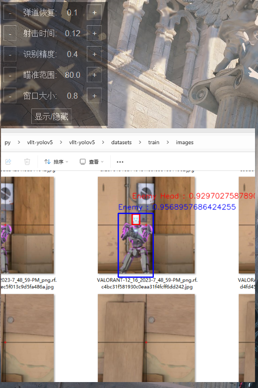
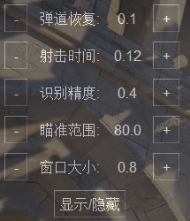

# 🚀 FK-WWQY

  
  

[中文](#-chinese) | [English](#-english)

## Screenshots

# 🌏 Chinese

基于yolov5的机器学习，实现的 FK 无畏契约

## 功能特点

- 🔄 可视化参数面板，你可以自定义的你的FK参数
- 🌓 自定义参数保存，最适合你的FK参数
- 🎯 实时目标检测，精准获取目标单位坐标

## 安装使用

1. git clone 本仓库
2. 必须先安装这个 pip3 install torch torchvision torchaudio --index-url https://download.pytorch.org/whl/cu121
3. 再运行 pip install -r requirements.txt
4. 安装driver中的 lghub_installer - 2021.3.5164.0 - 2021.3.9205.exe 驱动（请关闭驱动自动更新）
5. 最后请右键管理员运行 valorant.bat 脚本（裸奔有风险，建议使用exe，需自行打包，或联系我）
6. 如使用venv等虚拟环境请修改bat，内有说明

打包程序下载地址：https://pan.quark.cn/s/752e94abcedb

注意：由于github上传文件大小限制，不提供下载，需要打包好的exe请联系作者，WX：lookJlook

## 按键说明

1. home键隐藏/显示控制台
2. 鼠标右键FK射击（使用请取消游戏中的右键开镜） 
3. shift+esc 退出
4. F6开关自动扳机（仅打包程序有此功能）
5. shift+鼠标左键 锁身体（仅打包程序有此功能）

注意： 如游戏中移动出现误差，请调节游戏中的控制灵敏度，需设置为0.8。

# 🌟 English

Based on yolov5 machine learning, FK Fearless Contract is implemented

## Features

- 🔄 Visual parameter panel, you can customize your FK parameters
- 🌓 Custom parameter saving, the most suitable FK parameters for you
- 🎯 Real-time target detection, accurate acquisition of target unit coordinates

## Installation and use

1. git clone this repository

2. You must install this first pip3 install torch torchvision torchaudio --index-url https://download.pytorch.org/whl/cu121

3. Then run pip install -r requirements.txt

4. Install the lghub_installer - 2021.3.5164.0 - 2021.3.9205.exe driver in the driver (please turn off the automatic driver update)

5. Finally, right-click the administrator to run the valorant.bat script (there are risks in running naked, it is recommended to use exe, you need to package it yourself, or contact me)

6. If you use a virtual environment such as venv, please modify the bat, there are instructions

Package program download address: https://pan.quark.cn/s/752e94abcedb

Note: Due to the size limit of github upload files, download is not provided. If you need a packaged exe, please contact the author, WX: lookJlook

## Key Description

1. The home key hides/shows the console

2. Right click FK to shoot (please cancel the right click to open the scope in the game)
3. shift+esc to exit
4. F6 to switch the automatic trigger (only the packaged program has this function)
5. shift+left mouse button to lock the body (only the packaged program has this function)

Note: If there is an error in the movement in the game, please adjust the control sensitivity in the game, which needs to be set to 0.8.

## ⭐  Star History or Repobeats

